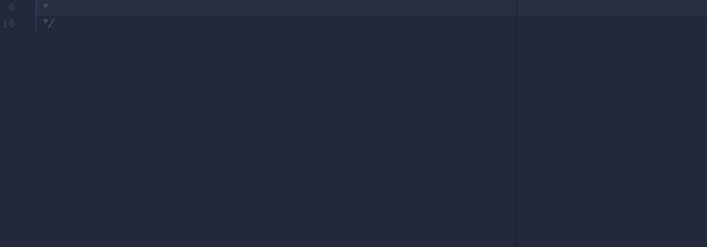
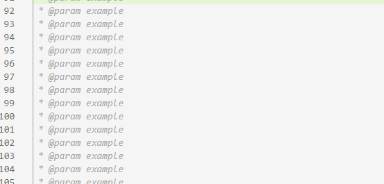

# RPG Maker Javascript pluginsnippet README

a code Snippet for RPG Maker MV and MZ Plugin developement.

Official Website: https://mjmcreativeworks.wordpress.com/
Contacts:
you may contact me at jomarlive@gmail.com

## Features

Contains all or most of the necessary plugin snippet for easier plugin production

## All avalable types

## Known Issues

No Know Issues been found

## Like my work
Support me on Ko-Fi

## Usage

### !RMMVStart

### !RMMVStruct

### !RMMVComment

### @Type

### other samples

## License

Copyright 2019 MJM Creative Works and Ideas

Permission is hereby granted, free of charge, to any person obtaining a copy of this software and associated documentation files (the "Software"), to deal in the Software without restriction, including without limitation the rights to use, copy, modify, merge, publish, distribute, sublicense, and/or sell copies of the Software, and to permit persons to whom the Software is furnished to do so, subject to the following conditions:

The above copyright notice and this permission notice shall be included in all copies or substantial portions of the Software.

THE SOFTWARE IS PROVIDED "AS IS", WITHOUT WARRANTY OF ANY KIND, EXPRESS OR IMPLIED, INCLUDING BUT NOT LIMITED TO THE WARRANTIES OF MERCHANTABILITY, FITNESS FOR A PARTICULAR PURPOSE AND NONINFRINGEMENT. IN NO EVENT SHALL THE AUTHORS OR COPYRIGHT HOLDERS BE LIABLE FOR ANY CLAIM, DAMAGES OR OTHER LIABILITY, WHETHER IN AN ACTION OF CONTRACT, TORT OR OTHERWISE, ARISING FROM, OUT OF OR IN CONNECTION WITH THE SOFTWARE OR THE USE OR OTHER DEALINGS IN THE SOFTWARE.

## thanks
Special thanks to Yeechan Lu (orzFly) for making the list of parameters from the Plugin editor demo in the past, without it the snippets might be incomplete or I have no idea what I am doing.
The RPG Maker Community as a whole for helping out in the developement of this extension
